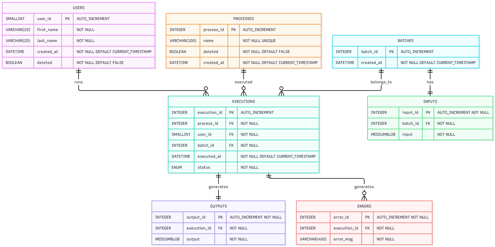

# Diagram design Document

By Orsa Ionut Cristian
Made with MermaidJs

---
config:
  layout: elk
---
erDiagram
    USERS ||--o{ EXECUTIONS : runs
    USERS {
        SMALLINT user_id PK "AUTO_INCREMENT"
        VARCHAR(20) first_name "NOT NULL"
        VARCHAR(20) last_name "NOT NULL"
        DATETIME created_at "NOT NULL DEFAULT CURRENT_TIMESTAMP"
        BOOLEAN deleted "NOT NULL DEFAULT FALSE"
    }

    PROCESSES ||--o{ EXECUTIONS : executed
    PROCESSES {
        INTEGER process_id PK "AUTO_INCREMENT"
        VARCHAR(100) name "NOT NULL UNIQUE"
        BOOLEAN deleted "NOT NULL DEFAULT FALSE"
        DATETIME created_at "NOT NULL DEFAULT CURRENT_TIMESTAMP"
    }

    BATCHES ||--o{ EXECUTIONS : belongs_to
    EXECUTIONS {
        INTEGER execution_id PK "AUTO_INCREMENT"
        INTEGER process_id FK "NOT NULL"
        SMALLINT user_id FK "NOT NULL"
        INTEGER batch_id FK "NOT NULL"
        DATETIME executed_at "NOT NULL DEFAULT CURRENT_TIMESTAMP"
        ENUM status "s4 NOT NULL"
    }

    BATCHES ||--|| INPUTS : has
    BATCHES {
        INTEGER batch_id PK "AUTO_INCREMENT"
        DATETIME created_at "NOT NULL DEFAULT CURRENT_TIMESTAMP"
    }

    EXECUTIONS ||--|| OUTPUTS : generates
    INPUTS {
        INTEGER input_id PK "AUTO_INCREMENT NOT NULL"
        INTEGER batch_id FK "NOT NULL"
        MEDIUMBLOB input "NOT NULL"
    }

    OUTPUTS {
        INTEGER output_id PK "AUTO_INCREMENT NOT NULL"
        INTEGER execution_id FK "NOT NULL"
        MEDIUMBLOB output "NOT NULL"
    }

    EXECUTIONS ||--o{ ERRORS : generates
    ERRORS {
        INTEGER error_id PK "AUTO_INCREMENT NOT NULL"
        INTEGER execution_id FK "NOT NULL"
        VARCHAR(400) error_msg "NOT NULL"

    }

The design assumes that each execution generates a single output file. If future requirements require multiple output files per execution, the schema would need to be extended.
The database is intended for a small team and is not optimized for large-scale enterprise workloads involving millions of executions or file uploads.
